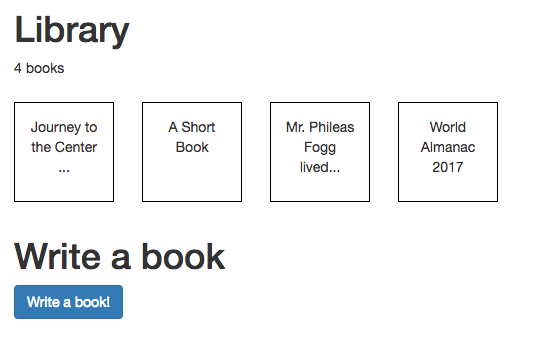
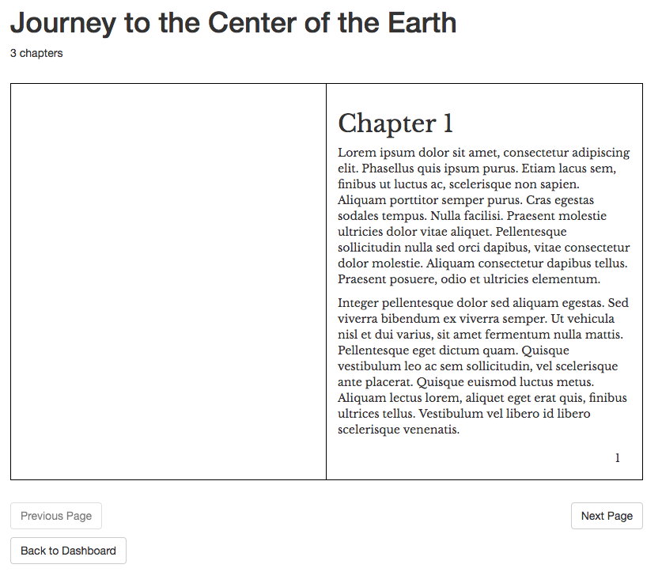
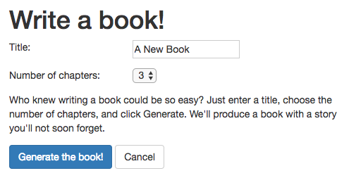

# Angular.js 1.5 demo

In this "Write Books" demonstration, the user can view a library of books, click to read one, or
write a new one.

---

* Dashboard view

---



---

* Read view

---



---

* Write view

---



---

Technologies:

* Angular.js 1.5
* JavaScript ES6 with Babel
* NodeJS 6.9.1
* Less stylesheets
* Karma unit tests
* Protractor Selenium tests
* Grunt, Bower, npm


This is just a client-side AngularJS demo, so there's no server-side to persist
the library of books, and no $http AJAX to talk to a server.  The library of books
is simply stored in the browser client memory and if you refresh the page it will
be gone.  To make it more interesting, we seed the library with some initial books.

---
Below are the instructions to build, run and test the project.

First, install the npm dependencies. (This brings in bower components as well.)
```
npm install
```

If you want to try it in a browser, at [http://localhost:8080](http://localhost:8080):
```
npm run build
npm run web-start   # Stays running til you Cmd+C / Ctrl+C to quit
```

To run the unit tests:
```
npm run unit-test
```

To run the selenium tests:
```
npm run webdriver-manager-update
npm run web-start   # Stays running, so type the next line in another terminal.
npm run selenium-test
```
(The 'webdriver-manager-update' step downloads the browser driver binary into node_modules,
so you only need to run it once.  You can run Selenium tests again without repeating that step.)

If you want to clean up and start fresh:
```
npm run clean
```

Some of those steps invoke `grunt` so if you want you could invoke grunt directly instead
of through npm.


